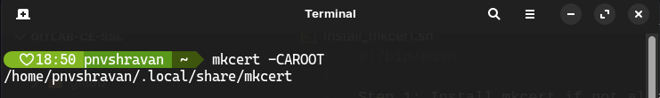
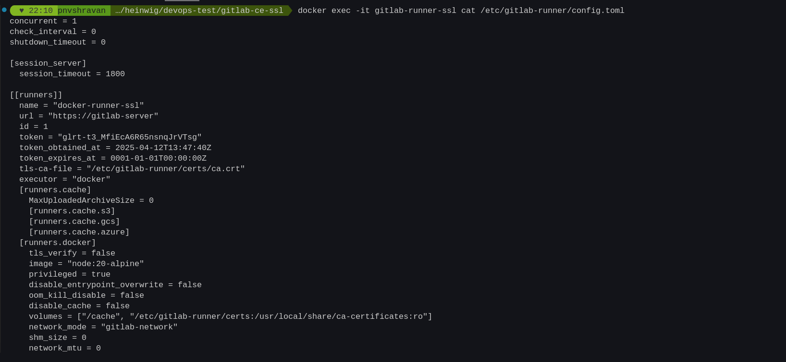
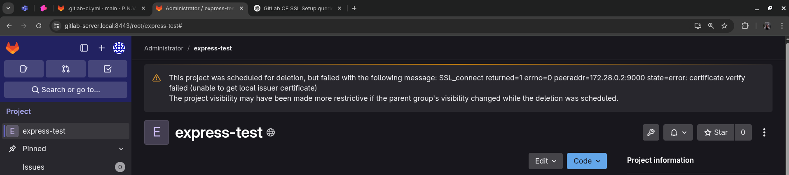

# gitlab-ce-docker

- Inspired by [hutchgrant](https://github.com/hutchgrant)'s Github repository -> [gitlab-docker-local](https://github.com/hutchgrant/gitlab-docker-local).

**Objective:**
- Setup [Gitlab Community Edition](https://gitlab.com/rluna-gitlab/gitlab-ce) using Docker Compose on your local machine along with a custom SSL certificate (using [`mkcert`](https://github.com/FiloSottile/mkcert) Certificate Authority (CA)). 

---
### Terminologies:-

1. **Gitlab-CE**: GitLab Community Edition (CE) is an open source end-to-end software development platform with built-in version control, issue tracking, code review, CI/CD, and more. Self-host GitLab CE on your own servers, in a container, or on a cloud provider.

2. **Gitlab-runner**: Runners are the agents that run the CI/CD jobs that come from GitLab.

3. **Docker-in-Docker** (DinD): It refers to running a Docker engine (daemon) inside a Docker container, allowing you to build and manage other containers within the CI/CD pipeline, which is useful for testing and building containerized applications. 

---
## HTTPS config:
- Inside your gitlab-ce folder, add the following files:
1. Firstly, create a `docker-compose.yml` file with contents:
```
services:
  gitlab-server:
    image: gitlab/gitlab-ce:latest
    container_name: gitlab-local-server-ssl
    hostname: gitlab-server
    environment:
      GITLAB_OMNIBUS_CONFIG: |
        external_url 'https://gitlab-server'

        # Disable Let's Encrypt
        letsencrypt['enable'] = false

        # GitLab NGINX Config
        nginx['listen_https'] = true
        nginx['listen_port'] = 443
        nginx['hsts_max_age'] = 0
        nginx['ssl_certificate'] = "/etc/gitlab/ssl/gitlab-server.crt"
        nginx['ssl_certificate_key'] = "/etc/gitlab/ssl/gitlab-server.key"
        nginx['redirect_http_to_https'] = true
        nginx['ssl_dhparam'] = nil

        gitlab_rails['gitlab_host'] = 'gitlab-server'
        gitlab_rails['gitlab_port'] = 443
        gitlab_rails['initial_root_password'] = '?'

        puma['worker_processes'] = 0
        gitlab_rails['gitlab_shell_ssh_port'] = 8022

        # Registry Settings
        registry_external_url 'https://gitlab-server:9000'
        registry['enable'] = true
        gitlab_rails['registry_enabled'] = true
        gitlab_rails['registry_host'] = 'gitlab-server'
        gitlab_rails['registry_port'] = 9000
        gitlab_rails['registry_api_url'] = 'https://gitlab-server:9000'

        registry_nginx['listen_https'] = true
        registry_nginx['listen_port'] = 9000
        registry_nginx['ssl_certificate'] = "/etc/gitlab/ssl/gitlab-server.crt"
        registry_nginx['ssl_certificate_key'] = "/etc/gitlab/ssl/gitlab-server.key"

    volumes:
      - ./gitlab/config:/etc/gitlab
      - ./gitlab/logs:/var/log/gitlab
      - ./gitlab/data:/var/opt/gitlab
      - ./gitlab/config/trusted-certs:/etc/gitlab/trusted-certs

      # SSL certs for nginx/registry
      - ./gitlab/ssl/gitlab-server.crt:/etc/gitlab/ssl/gitlab-server.crt
      - ./gitlab/ssl/gitlab-server.key:/etc/gitlab/ssl/gitlab-server.key

   
    ports:
      - '8500:80'
      - '443:443'
      - '9000:9000'
      - '8022:22'

    healthcheck:
      test: ["CMD", "curl", "-k", "--fail", "https://localhost/-/health"]
      interval: 60s
      timeout: 10s
      retries: 5

    networks:
      gitlab-network:
        aliases:
          - gitlab-server

  gitlab-runner:
    image: gitlab/gitlab-runner:alpine
    container_name: gitlab-runner-ssl
    privileged: true
    depends_on:
      gitlab-server:
        condition: service_healthy
    volumes:
      - /var/run/docker.sock:/var/run/docker.sock
      - ./gitlab-runner/config:/etc/gitlab-runner
      - /builds:/builds
      - /cache:/cache
      - ./certs/gitlab/gitlab-server.crt:/etc/gitlab-runner/certs/ca.crt
    networks:
      - gitlab-network
    extra_hosts:
     - "gitlab-server:172.28.0.2"

networks:
  gitlab-network:
    external: true
```

**Note:**
> The GitLab runner mounts your repo to `/builds/...` inside the Docker container running the pipeline.
> The DinD service `(docker:dind)` doesn't know about your runner mounts unless you explicitly reference them.

2. Create a `install_mkcert.sh` file with contents:
```
#!/bin/bash

Step 1: Install mkcert if not already installed
if ! command -v mkcert &> /dev/null; then
    echo "Installing mkcert..."
    sudo apt install libnss3-tools -y   # Required for mkcert on Linux
    wget https://dl.filippo.io/mkcert/latest?for=linux/amd64 -O mkcert
    chmod +x mkcert
    sudo mv mkcert /usr/local/bin/
fi

# Step 2: Set up mkcert CA (only runs once)
mkcert -install
```

3. Create a `setup_gitlab_ssl.sh` file with contents:
```
#!/bin/bash

#Generate SSL certificate for GitLab
domain="gitlab-server.local"
container="gitlab-local-server-ssl"

mkdir -p certs/gitlab
cd certs/gitlab || exit
mkcert -cert-file ${domain}.crt -key-file ${domain}.key ${domain}
cd ../..

# Copy cert + key for mounting into GitLab NGINX
mkdir -p gitlab/ssl
cp ./certs/gitlab/${domain}.crt ./gitlab/ssl/
cp ./certs/gitlab/${domain}.key ./gitlab/ssl/

# Copy mkcert root CA for trust
cp "$(mkcert -CAROOT)/rootCA.pem" ./certs/gitlab/mkcert-rootCA.crt

# Copy mkcert CA to GitLab's built-in trusted certs location
mkdir -p gitlab/config/trusted-certs
cp ./certs/gitlab/mkcert-rootCA.crt ./gitlab/config/trusted-certs/

echo "🚀 Starting GitLab with Docker Compose..."
docker compose up -d --build

#Add domain to /etc/hosts
echo "127.0.0.1 ${domain}" | sudo tee -a /etc/hosts

# Validate container is running
if ! docker ps --format '{{.Names}}' | grep -q "^${container}$"; then
  echo "❌ Container '$container' is not running. Please start it using 'docker compose up -d'."
  exit 1
fi

# Wait for health check to pass
echo "⏳ Waiting for GitLab container to be healthy..."
until [ "$(docker inspect -f '{{.State.Health.Status}}' "$container" 2>/dev/null)" = "healthy" ]; do
  echo "   🕒 Waiting for container healthcheck..."
  sleep 5
done

echo "🔐 Trusting mkcert CA inside container..."
docker exec -it $container update-ca-certificates

echo "🔧 Making Ruby trust mkcert CA..."
docker exec -it $container bash -c "cp /etc/ssl/certs/ca-certificates.crt /opt/gitlab/embedded/ssl/certs/cacert.pem"

echo "♻️ Restarting GitLab services..."
docker exec -it $container gitlab-ctl reconfigure
docker exec -it $container gitlab-ctl restart

echo "✅ Done! GitLab should now trust mkcert CA and be fully functional with SSL."
echo "Setup complete! 🛠️ Access GitLab at: https://${domain}"

echo "📋 Showing logs from container $container..."

docker logs -f "$container"
```
---
### Setup:
3. Ensure your network exists by running:
`docker network ls`
  - If you don't see "gitlab-network" listed, you'll need to create it manually before starting your docker-compose setup:
  `docker network create gitlab-network`

4. Run the `install_mkcert.sh` bash script on your terminal with command:
`sudo sh install_mkcert.sh`

- To verify if mkcert is installed properly on your machine, run this command on your terminal -
`mkcert -CAROOT` , and should show the directory where its got installed like below:


5.  Run the `setup_gitlab_ssl.sh` bash script on your terminal with command for the first time:
`sh setup_gitlab_ssl.sh`
- This script does the following things:
✅ Generates the certs.
✅ Copies everything to persistent volumes.  
✅ Waits for GitLab container to be healthy. 
✅ Installs and trusts the root CA persistently.
✅ Adds an DNS entry at path: /etc/hosts automatically.
✅ Starts up both containers for the first time and logs are shown in terminal.  

6. Run this command after you started your Gitlab server container to see its IP on another instance of your terminal:
`docker inspect -f '{{range .NetworkSettings.Networks}}{{.IPAddress}}{{end}}' container_name`
- here, container_name (in this case - `gitlab-local-server-ssl`) which is mentioned in your `docker-compose.yml`.

7. In the terminal which shows up logs after Step-5, stop the containers using command: `docker compose down`. Now
replace the IP under `extra_hosts` variable of `gitlab-runner` service in your `docker-compose.yml` (86th line) with the IP shown when you run the Step-6.
```  
extra_hosts:
     - "gitlab-server:IP"
```
8. Change the Gitlab's initial root password to your liking at `docker-compose.yml` (24th line):
`gitlab_rails['initial_root_password'] = '?'`, where replace the `?` with your preferred password, where conditions are:
- The minimum password length is set to 8 characters by default, but you can increase this in the GitLab UI.
- GitLab also checks for weak passwords, such as those containing commonly used combinations or parts of your name, username, or email.
- Password should be a mix of special characters, number, capital letters,... 

9. Now start up the containers using the command: `docker compose up --build`
**Note:** Use the `--build` option only when changes are done in configuration. 
Otherwise:
- To start the containers: `docker compose up` 
- To stop the containers: `docker compose down`

---
### Post Setup:
1. Command to register a project runner for a specific repo:
```
docker exec -it gitlab-runner-ssl gitlab-runner register \
  --non-interactive \
  --url "https://gitlab-server" \
  --token "$RUNNER_TOKEN" \
  --docker-image "alpine:latest" \
  --executor "docker" \
  --description "docker-runner-ssl" \
  --docker-network-mode="gitlab-network" \
  --docker-privileged \
  --tls-ca-file "/etc/gitlab-runner/certs/ca.crt"
```
2. Command to see the config.toml file in `/gitlab-runner/config` folder :
`docker exec -it gitlab-runner cat /etc/gitlab-runner/config.toml`

**Note:**
- The **GitLab runner should be running in privileged mode**, which is often required for DinD.

- Make sure your GitLab Runner is configured with privileged mode enabled in `config.toml`:
```toml
[[runners]]
  ...
  [runners.docker]
    privileged = true
```
> Otherwise `DinD` won’t fully start properly (which matches your logs like: `mount: permission denied (are you root?)` and failing health checks).

3. After running the Step-2, there is a need to change some lines in the config.toml wrt runner, look for `volumes` under [runners. docker], where you will find `volumes = ["/cache"]`, and this line should be replaced with `volumes = ["/cache", "/etc/gitlab-runner/certs:/usr/local/share/ca-certificates:ro"]` and can be seen in below image:



---
## Errors encountered:

1. Error while deleting a project created in root.



✅ **Solution: Trust the mkcert Root CA inside the GitLab container**
Thanks! That output pinpoints the problem perfectly: **GitLab container doesn't trust your mkcert-generated root CA** yet — so it can't verify the registry certificate.

1. 🔧 Fix: Explicitly trust mkcert’s root CA

You already mounted the mkcert CA to `/usr/local/share/ca-certificates/mkcert-rootCA.crt`, but that isn’t enough until it’s processed into system certs.

🛠️ Step-by-step inside the GitLab container:

```bash
docker exec -it gitlab-local-server-ssl bash
```

- Then run:

```bash
# Copy CA into trust directory (should already be there from volume)
cp /usr/local/share/ca-certificates/mkcert-rootCA.crt /usr/local/share/ca-certificates/mkcert-rootCA.crt

# Update trusted certs
update-ca-certificates

# Double-check that it was added
ls -l /etc/ssl/certs/ | grep mkcert
```

You should see something like:
```
lrwxrwxrwx 1 root root    45 Apr 10 12:00 mkcert-rootCA.pem -> /usr/share/ca-certificates/mkcert-rootCA.crt
```


2. Now verify again:

```bash
openssl verify -CAfile /etc/ssl/certs/ca-certificates.crt /etc/gitlab/ssl/gitlab-server.local.crt
```

**Expected Output:**
```
/etc/gitlab/ssl/gitlab-server.local.crt: OK
```

3. 🔁 Final important step: Make Ruby inside GitLab trust this

Still in the same container:

```bash
cp /etc/ssl/certs/ca-certificates.crt /opt/gitlab/embedded/ssl/certs/cacert.pem
```

This ensures GitLab services like the registry client and Rails app trust the mkcert CA.


4. 🔄 Then restart GitLab:

```bash
gitlab-ctl reconfigure
gitlab-ctl restart
```

Once it comes back up, retry the curl check:

```bash
curl -vk https://gitlab-server.local:9000/v2/
```
**Expected Output:**
✅ A `401 Unauthorized` means it’s working perfectly (registry is up and using SSL).

- These steps have been included in `setup_gitalb_ssl.sh` file as part of automation.
---

## Issues that one may encountered:

### 1. Stop Apache server on Ubuntu / Linux-based OS as it can interfere with port config done in `docker-compose.yml`:
- Verify host OS isn't running Apache, on your host:
```
sudo netstat -tuln | grep ':80'
sudo netstat -tuln | grep ':9000'
```
Do you see an Apache running outside of Docker on port 80 or 9000?. If you see something like the below:
```
tcp        0      0 0.0.0.0:8080            0.0.0.0:*               LISTEN     
tcp6       0      0 :::80                   :::*                    LISTEN     
tcp6       0      0 :::8080                 :::*                    LISTEN     
tcp        0      0 0.0.0.0:9000            0.0.0.0:*               LISTEN     
tcp6       0      0 :::9000                 :::*                    LISTEN  
```
- Stop or disable the service on your host:
If it's Apache:
```
sudo systemctl stop apache2
sudo systemctl disable apache2
```
If it's nginx:
```
sudo systemctl stop nginx
sudo systemctl disable nginx
```

**Note:**
> **Port 443 must be free** on your host system. If anything else (like Apache, nginx, or another service) is using 443, Docker will fail to start the GitLab container.
> You may need **sudo/root** to bind to privileged ports like 443.
> If you’re running this on macOS or Windows with Docker Desktop, binding to 443 is usually okay as long as it's not in use.

---
## Q&A ❔❕
### 1. Use of `extra_hosts` in `docker_compose.yml` ?
- Let’s break down **why** you'd add a DNS entry like this in your `docker-compose.yml` using `extra_hosts`:

❓❗ **Problem:**
Inside a **Docker container**, hostname resolution doesn’t always work as expected — especially if:
- You’re using a **custom hostname** like `gitlab-server`.
- You're trying to access **another container** (like GitLab) by that name **from a different Docker network** (e.g., the GitLab Runner container).
- Or, your hostname (`gitlab-server`) is **not a real DNS entry**, and mkcert has generated a cert for it.

So when Git tries to clone a repo from `https://gitlab-server:443/...` inside the GitLab Runner container, it doesn’t know where `gitlab-server` is — leading to errors like `Could not connect to server`.


✅ **Solution:**
You tell Docker **explicitly**:  
> “Hey, when you see `gitlab-server`, treat it as IP `172.x.x.x`.”

You do this by adding:
```yaml
gitlab-runner:
  ...
  extra_hosts:
    - "gitlab-server:172.20.0.2"
```

> 🔍 This is the same as editing `/etc/hosts` inside the container:  
> `172.20.0.2 gitlab-server`

Now:
- When Git in the runner tries to resolve `gitlab-server`, it goes directly to the correct IP.
- The SSL cert still works because it was issued to `gitlab-server` (not the IP).
- No DNS lookup fails. No SSL mismatch.

🔁 **Why not just use the IP?**

Because the SSL certificate **was issued for the hostname** `gitlab-server` by mkcert. If you try to access by IP (`https://172.20.0.2:443`), SSL validation **fails** due to mismatched hostname.

So using `extra_hosts` lets you:
- Stick with the correct **SSL hostname**,
- While still ensuring the container can resolve that hostname to the correct **IP address**.

---
## References & Links:
- Install self-managed GitLab: https://about.gitlab.com/install/
- Register a runner in Docker: https://docs.gitlab.com/runner/register/?tab=Docker
- Configure SSL for a Linux package installation: https://docs.gitlab.com/omnibus/settings/ssl/#configure-https-manually
- Self-signed certificates or custom Certification Authorities: https://docs.gitlab.com/runner/configuration/tls-self-signed/
